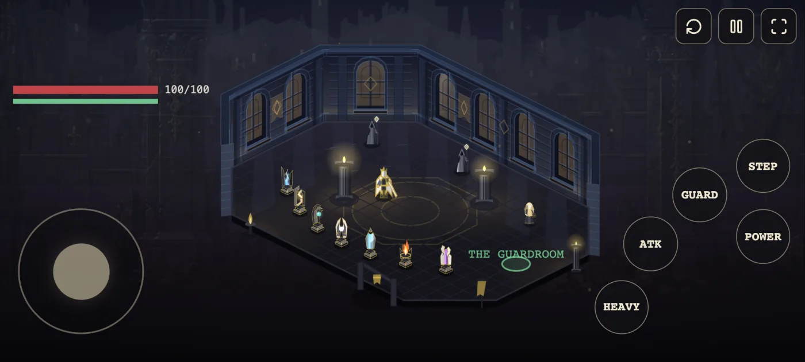

# Crown Lab

**A mastery laboratory, not a game.**

It exists to falsify design hypotheses about flow, mastery, and presentation-subtraction for the
project *Fabricating Flow State* (working game title: *The Last King* / *The Fallen Crown*).
Success is measured by how fast it kills bad ideas, not by how finished it looks.

Published for reading. **All rights reserved** — see [Rights](#rights).



*The first room, captured at the supported mobile profile — 984×443 CSS at a device pixel ratio of
2.4375, which is a real phone measured rather than a round number chosen. The thumb cluster is what
the layout is designed around: `light`, `heavy`, `guard` and `step` sit on one arc of constant
radius, because the thumb's two axes do not cost the same.*

---

## What is actually true here

Two numbers are kept apart on purpose, and it is the most important thing to understand about
this project: **built** — the software exists and its tests pass — and **believed** — an
experiment produced evidence at the required rung. The first is at 8.5 of 11 phases. The second
is at zero: no experiment has been run and no hypothesis has been tested.

Building on the first without the second is sanctioned. *Citing* the first as the second is the
exact failure the split exists to prevent. So the mastery estimator's thresholds are uncalibrated
guesses, and the presentation-subtraction stack was built ahead of its gate and knows it. If you
find a confident-looking result in here, it is a measurement of the instrument, not of a player.

## Quick start

```bash
npm install
npm run dev      # http://localhost:5173
npm run check    # typecheck + tooling + rooms + tests — must pass before anything is "done"
```

`npm install` also activates a pre-commit gate that requires an adversarial release review. That
is deliberate. There is no Docker here; `npm` on the host is correct.

## Two builds, and the boundary between them

```bash
npm run build                            # the public game. audited, no lab graph
npm run build:lab -- --recipient <id>    # the private lab, watermarked, never deployed
```

The separation is structural, not cosmetic: lab code enters through `src/app/lab.ts`, public
runtime code through `src/app/game.ts`, and hiding a lab control with CSS or a runtime flag does
not count as separation. `tests/public-graph.test.ts` walks the public import graph and fails on
anything lab-only reaching it — including a census that accounts for *every* module under `src/`
as public graph, lab apparatus, or recorded-dormant. That census is why there is almost no
accidental dead code here: an unreferenced file cannot sit unnoticed, it has to be argued for by
name.

## Repository map

| Path | What it holds |
|---|---|
| `src/sim/` | the deterministic simulation. Imports nothing outside itself — no DOM, no `Date`, no `Math.random` |
| `src/render/` | everything that draws. Never mutates the world |
| `src/game/`, `src/app/` | the public game, and the two entrypoints that define the build boundary |
| `src/lab/` | apparatus: the estimator, metrics, the scripted pilot, config |
| `services/signaling/` | the WebRTC co-op handshake. Its own dependency tree, in neither build, holds no state |
| `scripts/` | headless tooling — benchmarks, audits, determinism sweeps, room export |
| `tools/blender/` | the room pipeline, as checked-in Python |

## The rules that hold it together

Four invariants explain most of the design, and breaking any of them silently invalidates work
rather than crashing:

1. **The simulation is perspective-agnostic.** World space is a flat 2D plane in world units. No
   isometry, no camera, no pixels anywhere under `src/sim/` — the isometric look lives entirely in
   `src/render/iso.ts`, so a change of viewpoint is a render change and not a rewrite.
2. **The simulation is deterministic.** `stepWorld` depends on nothing but its arguments. Same
   seed and same intents give a bit-identical world, which is what makes replay and A/B comparison
   possible at all. Never add an RNG draw in the middle of an existing sequence — it shifts every
   number after it and invalidates saved replays. Append at the end.
3. **Time is counted in ticks, not frames.** Slow motion is not a variable tick rate; it is a
   per-entity `timeScale`, and it lives *inside* the simulation because it changes what the player
   can do. Advance timers by the `dtMs` you were given, never by `TICK_MS`.
4. **Observation is separate from interpretation.** The simulation emits raw events and nothing
   else. It never computes a score and never decides what the HUD shows; derivation happens in
   `src/lab/`.

Two more that cost the most time when forgotten: the renderer never mutates the world, and no
element names a viewport coordinate — `src/render/layout.ts` resolves the screen into named
regions and every on-screen element takes its box from one.

## Rights

**The code carries no licence and all rights are reserved.** There is deliberately no `LICENSE`
file, because one would imply a grant that is not being made.

The assets are a separate matter and are each stated on their own terms in
**[`NOTICE.md`](NOTICE.md)**. In short: the Kenney sound effects and the Poly Haven textures are
CC0, the Tabler icon geometry is MIT (attribution in [`ICONS.md`](ICONS.md)), and the Suno music,
the Meshy/Mixamo cast bodies and the AI-generated concept art are **not** reusable — their
licences are recorded as *unknown*, which is a statement about the record rather than a
permission.
